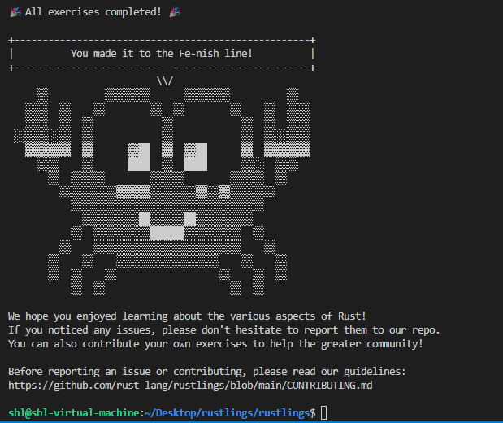

# rustlings

网址

- [Small exercises to get you used to reading and writing Rust code!](https://github.com/rust-lang/rustlings)

最终结果图

一共84个题目，时间耗费还是相当长的。

我的解答网址 :https://github.com/Shl1015CS/os2022/tree/master/my-rustlings/exercises

题目是最新版本的。

第一天任务是：

- variables
- if
- fuctions
- strings
- structs
- tests
- enums
- modules
- move-semantics
- quiz 1-2

第二天任务是:

- standard_library_types
- primitive_types
- option
- move_semantics
- generics
- error_handling
- enums
- collections
- conversions
- advanced_errors
- quiz3-4

从第二天开始，难度还是大的，学过之后做题发现还是要重新学，重新看。

